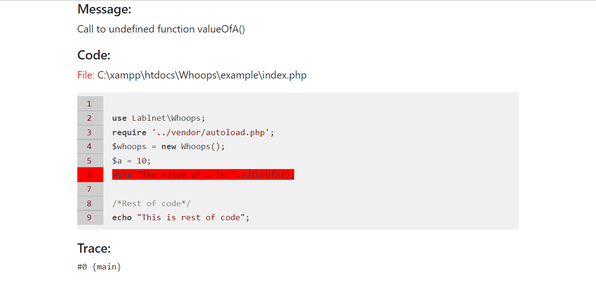

# Whoops
Whoops is a PHP library for handling exceptions and errors.

## Requirement
- PHP
- Composer

## Features
- Flexible, stack-based error handling.
- Stand-alone library with (currently) no required dependencies.
- Highlight the error line with red color.
- Show preview code in browser.
- Clean, well-structured & tested code-base.


## Insallation
Installing this package is very simple, first ensure you have the right PHP version and composer installed then in your terminal/(command prompt) run: 
```composer require lablnet/whoops```

Register the handler in your code
```php $whoops = new Whoops();```

## usage
Example:
```php
<?php 
use Lablnet\Whoops;
require '../vendor/autoload.php';
$whoops = new Whoops();
$a = 10;
echo "The value of a is ".valueOfA();

/*Rest of code*/
echo "This is rest of code";
```

## Output



## TODO

- [x] Bootstrap 4 ready.	 
- [ ] Add new feature to show Enviroment details.
